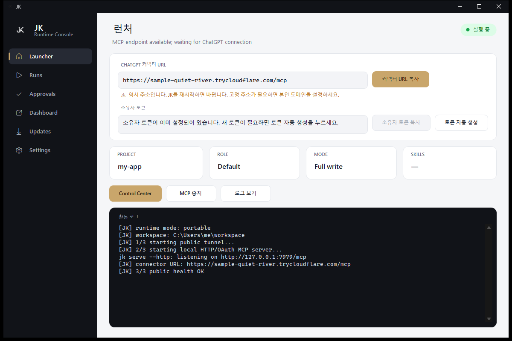
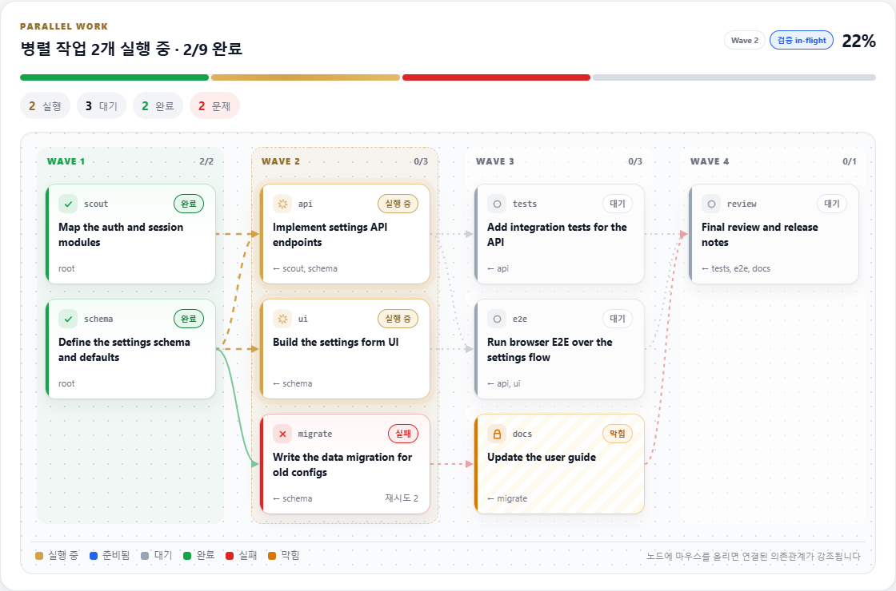

<p align="center">
  
</p>

# JK

**ChatGPT에게 내 컴퓨터에서 일할 손을 달아줍니다. 코드를 읽고, 고치고, 테스트를 돌리고, 결과를 증거로 보여줍니다. 하던 작업은 JK가 기억하고 안전하게 지킵니다.**

[English](README.md) | [한국어](README.ko.md)

JK는 **Anjingyeong**이 설계하고 만든 무료 로컬 MCP 앱입니다([ezBuilder/chatgpt2codex](https://github.com/ezBuilder/chatgpt2codex)에서 시작). 설치하고 프로젝트 폴더를 고른 뒤 ChatGPT에 연결하면, 평소 쓰던 대화창이 코드에 대해 말만 하는 게 아니라 실제 프로젝트에서 직접 일합니다.

> JK는 OpenAI와 제휴·후원·승인 관계가 없는 독립 프로젝트입니다. OpenAI, ChatGPT, GPT, Codex는 OpenAI의 상표 또는 제품입니다.

## 왜 만들었나

ChatGPT는 코드를 잘 이해하지만, 혼자서는 내 저장소를 볼 수도, 테스트를 돌릴 수도 없고, 어디까지 했는지도 잊어버립니다. 그래서 보통은 파일을 복사해서 붙여넣고, 답을 다시 복사해서 붙여넣습니다. 느리고 실수하기 쉽고, 그 수정이 정말 되는지는 직접 확인해 봐야 알 수 있습니다.

JK는 AI 구독을 하나 더 늘리지 않고 이 간극을 메우려고 만들었습니다.

- **생각은 계속 ChatGPT가 합니다.** JK는 AI 모델이 아니라 로컬 실행 계층입니다. 지금 쓰는 ChatGPT 요금제를 그대로 씁니다.
- **작업이 대화를 넘어 이어집니다.** 목표, 건드린 파일, 결정 사항, 검증 결과를 JK가 저장하니까 "아까 하던 거 이어서 해줘"가 진짜로 이어집니다.
- **결과에 증거가 붙습니다.** "이제 될 거예요" 대신, 내 프로젝트 명령으로 직접 검증한 실행 결과를 보여줍니다.
- **내 컴퓨터의 주인은 나입니다.** 고른 폴더 안에서만 동작하고, 위험한 작업은 내 승인을 기다리며, 비밀값은 가려집니다.

## 쓰면 뭐가 달라지나

| JK 없이 | JK와 함께 |
|---|---|
| 파일을 복사해서 붙여넣고, 답을 다시 붙여넣기 | ChatGPT가 파일을 직접 읽고 수정 |
| "이렇게 고치면 될 거예요" | 테스트까지 돌리고 통과한 출력을 보여줌 |
| 새 대화는 처음부터 다시 | 이전 작업, 파일, 결정 사항을 이어서 진행 |
| 원본에서 바로 큰 수정 | 별도 작업 워크스페이스에서 작업하고 검증된 변경만 반영 |
| 에이전트가 뭘 하는지 모름 | Control Center에서 병렬 작업을 의존관계 그래프로 실시간 확인 |

## 다운로드

[Releases 페이지](https://github.com/Anjingyeong/jk-mcp/releases)에서 앱을 받으세요. Node.js, cloudflared, ripgrep이 앱에 들어 있어서 터미널이 필요 없습니다.

| OS | 파일 |
|---|---|
| Windows | `JK-...-windows-setup.exe` |
| macOS | `jk-....pkg` |

아직 코드 서명이 되어 있지 않습니다. Windows SmartScreen이 뜨면 공식 Releases 페이지에서 받은 파일일 때만 **추가 정보 → 실행**을 누르세요.

macOS에서 "확인되지 않은 개발자" 때문에 열리지 않으면, Finder에서 `.pkg`를 **우클릭(Control-클릭) → 열기 → 열기**를 누르거나 **시스템 설정 → 개인정보 보호 및 보안 → 그래도 열기**를 누르세요.

### 터미널이 편하다면

Node.js 22+가 있으면 명령 하나로 설정이 끝나고, 커넥터 URL·Control Center·헬스체크 링크가 출력됩니다(Ctrl+클릭으로 열기).

```bash
npx -y jk-mcp setup
```

다음에도 같은 명령을 실행하면 됩니다. 저장된 폴더와 연결 코드를 그대로 씁니다. `npm install -g jk-mcp` 후에는 `jk start`로도 켤 수 있습니다.

## 빠른 시작

1. **JK**를 설치하고 실행합니다. 시계 옆 트레이(macOS는 메뉴 막대)에 아이콘이 생깁니다.
2. **설정...**을 열고 **프로젝트 폴더**에서 ChatGPT가 작업할 폴더를 고릅니다.
3. **토큰 자동 생성**을 누른 뒤 **소유자 토큰 복사**로 복사합니다. 비밀번호처럼 보관하세요.
4. **ChatGPT 웹 커넥터 사용**을 켜고 **MCP 시작**을 누릅니다.
5. **커넥터 URL 복사**를 누릅니다. 주소는 `/mcp`로 끝납니다.
6. ChatGPT의 **Apps & Connectors / Connectors**(플러그인 생성)에서 새 커넥터를 만들고 URL을 붙여넣습니다.
7. JK 로그인 창이 뜨면 복사한 소유자 토큰(Owner Token)을 붙여넣습니다.
8. 확인용으로 이렇게 요청해 보세요: `@jk 이 프로젝트 README 읽고 현재 상태 요약해줘.`

<p align="center">
  
</p>

### Connector URL: 임시 주소 vs 내 도메인

| | 도메인 없음 (기본) | 내 도메인 있음 (선택) |
|---|---|---|
| 주소 | `https://<랜덤>.trycloudflare.com/mcp` | `https://mcp.example.com/mcp` |
| 준비 | 없음. JK가 Cloudflare Quick Tunnel을 자동으로 만듭니다. | Cloudflare Named Tunnel이나 HTTPS 리버스 프록시를 `http://127.0.0.1:7979`로 연결하고, 그 호스트명을 **본인 소유 고정 도메인 (선택)**에 넣습니다. |
| JK 재시작 후 | **주소가 바뀝니다.** ChatGPT 커넥터 URL을 새 주소로 바꾸고 다시 로그인해야 합니다. | 주소가 그대로입니다. |
| 추천 용도 | 체험, 짧은 사용 | 매일 사용 |

도메인은 있으면 편하지만 필수는 아닙니다. 자세한 설정은 [설치 가이드](docs/INSTALL.md)를 참고하세요.

## 이렇게 요청하면 됩니다

```text
@jk 이 프로젝트 구조 뜯어서 설명해줘. 수정은 하지 마.
@jk 이 버그 원인 찾아서 고치고 관련 테스트까지 해줘.
@jk 아까 하던 작업 이어서 마무리해줘.
@jk 별도 작업 워크스페이스에서 구현하고 검증 후 원본에 반영해줘.
@jk E2E 테스트하고 통과 근거까지 보여줘.
@jk 현재 diff 리뷰하고 검증 통과하면 커밋해줘.
```

원하는 걸 평소 말투로 말하면 됩니다. 도구 이름을 외울 필요는 없습니다.

## 기능

### 이어지는 작업
- **지속 작업 세션**: 현재 목표, 작업 파일, 남은 일, 결정 사항, 체크포인트, 검증 결과를 프로젝트별로 저장해서, 후속 요청이 실제 작업을 이어갑니다.
- **체크포인트**: JK가 바꾼 파일을 이전 상태로 되돌릴 수 있습니다.

### 믿을 수 있는 수정
- **보호된 수정**: 기존 파일 수정에 SHA-256 precondition을 붙일 수 있습니다. 읽은 뒤에 파일이 바뀌었으면 최신 작업을 덮어쓰지 않고 수정을 거부합니다.
- **검증 증거**: 테스트, 빌드, E2E를 로컬에서 실제로 돌리고 그 출력을 증거로 돌려줍니다.
- **작업 워크스페이스**: 프로젝트의 별도 복사본에서 구현하고 검증한 뒤, 리뷰를 통과한 변경만 원본에 반영합니다. 그사이 원본이 바뀌었으면 무작정 합치지 않고 반영을 거부합니다. [Task Workspaces](docs/TASK_WORKSPACES.ko.md) 참고.

### 큰 작업도 정리해서
- **JK 오케스트레이션**: `goal_intake`와 `goal_loop`가 Explorer, Oracle, Implementer, Reviewer, Verifier, Recovery 역할로 긴 코딩 작업을 돌립니다. 검증에 실패하면 같은 시도를 반복하지 않고 계획을 다시 세웁니다.
- **MASS ULW 병렬 작업**: 한 ChatGPT 대화 안에서 작업을 의존관계가 있는 lane으로 나눠 구현·검증·수정·리뷰를 병렬로 진행합니다. [MASS ULW 워크플로우](docs/MASS_ULW_WEB.ko.md) 참고.
- **OMO 위임 (선택)**: 로컬에 OMO / Oh My OpenAgent가 있으면 일부 작업을 넘길 수 있습니다. 상태·안전·검증 기준은 JK가 유지합니다.

### 무슨 일이 일어나는지 보이게
- **Control Center**: 현재 작업, 승인, 실행 호스트, 활동을 보는 로컬 대시보드.
- **실시간 의존관계 그래프**: 병렬 작업을 Wave별 DAG로 그립니다. lane 상태별 색, 실행 중인 lane으로 흐르는 애니메이션, 마우스를 올리면 해당 lane의 의존관계 강조까지 보여줍니다.

<p align="center">
  
</p>

### 코딩에 필요한 건 다
프로젝트 선택, 코드 검색, 좁은 범위 읽기, 보호된 패치, 허용된 명령과 shell job, Git status/diff/commit/명시적 push, 개발 서버, 스크린샷을 포함한 브라우저 E2E, 이미지 intake, 외부 MCP 라우팅, 런타임 상태 점검.

## 안전 모델

JK는 신뢰할 수 있는 개발 환경에서 쓰는 것을 전제로 합니다.

- 선택한 프로젝트 폴더 안에서만 접근합니다.
- 민감한 shell, 네트워크, Git 공개, 삭제성 작업은 승인이 필요합니다.
- 비밀값처럼 보이는 내용은 도구 출력에서 가립니다.
- project lease와 작업 소유권으로 동시 수정 충돌을 막습니다.
- Owner Token 인증이 없는 MCP 요청은 거부합니다. 토큰을 새로 발급하면 기존 로그인은 끊기지만 등록한 커넥터는 그대로 남습니다.

Owner Token, 터널 자격증명, 도메인 자격증명은 스크린샷, 로그, issue, 채팅에 절대 올리지 마세요. 유출되면 **설정**에서 새로 발급하세요.

## 개발자용: 소스에서 빌드

필요한 것: Node.js 22+, npm, Windows에서는 PowerShell.

```bash
npm ci
npm run typecheck
npm test
npm run build
```

소스에서 실행:

```powershell
npm run chatgpt:windows   # Windows
```

```bash
npm run chatgpt           # macOS
npm run chatgpt:linux     # Linux
```

패키징과 E2E:

```powershell
npm run windows:package
npm run windows:e2e
```

<details>
<summary>저장소 구조</summary>

```text
src/
  auth/           인증 / Owner Token
  code/           검색, 읽기, 패치
  control/        제어 안전 경로
  control-center/ 로컬 운영 UI
  e2e/            브라우저 E2E / 증거
  exec/           command, shell, OMO runner
  executors/      로컬/원격 실행 라우팅
  orchestration/  MASS ULW / 장기 작업 로직
  policy/         승인, 경로, 비밀값, shell job 정책
  roles/          JK 오케스트레이션 역할
  server/         MCP tools / Actions bridge
  state/          지속 프로젝트/작업 세션 상태
  workspace/      프로젝트 registry / lease

windows/          Windows launcher / tray / installer
macos/            macOS 실행 경로
linux/            Linux 실행/설치 경로
scripts/          build / package / release / 검증
docs/             사용법 / 설계 / 엔지니어링 문서
assets/           JK 공개 리소스
```

</details>

## 만든 사람

JK는 **Anjingyeong**이 설계하고 만들고 유지보수합니다. 문제가 생기면 앱 사이드바나 트레이 메뉴의 **Report issue**, 또는 Control Center의 **문제 신고 · 피드백**을 누르세요. 버전과 OS가 미리 채워진 [issue](https://github.com/Anjingyeong/jk-mcp/issues) 작성 페이지가 열립니다. 보안 문제는 [SECURITY.md](SECURITY.md)를 참고해 비공개로 알려주세요. PR은 [CONTRIBUTING.md](CONTRIBUTING.md)를 참고하세요.

JK는 **[ezBuilder/chatgpt2codex](https://github.com/ezBuilder/chatgpt2codex)**에서 시작했고, 원저작자의 허락을 받아 사용했습니다. 원본을 만들어 주신 ezBuilder님께 감사드립니다. [ACKNOWLEDGEMENTS.md](ACKNOWLEDGEMENTS.md)와 [Attribution and compliance notes](docs/ATTRIBUTION_AND_COMPLIANCE.md)를 참고하세요.

## 라이선스

[MIT](LICENSE) © 2026 Anjingyeong. 포크하거나 재배포할 때는 원본 저장소 표기([NOTICE](NOTICE))를 유지해 주세요.
